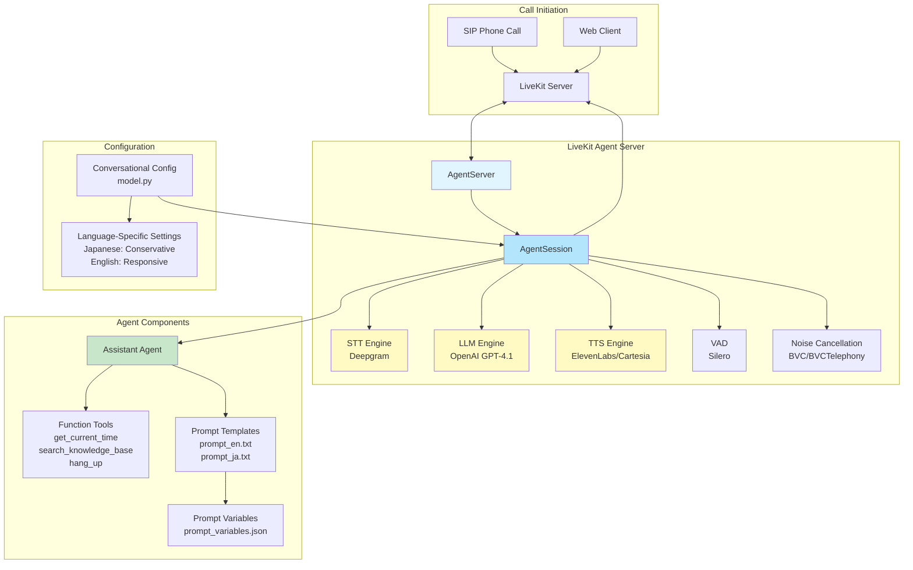
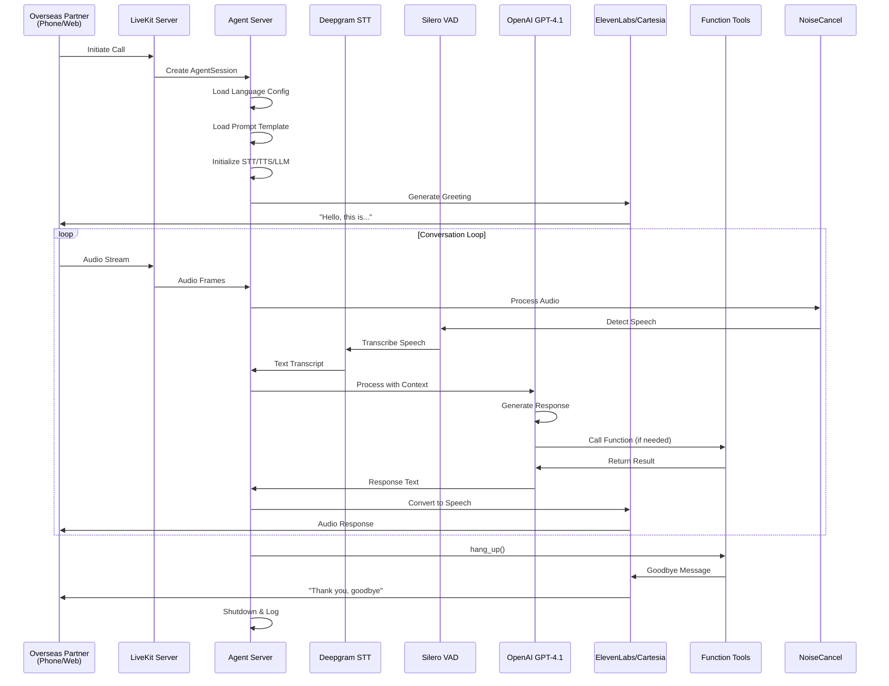
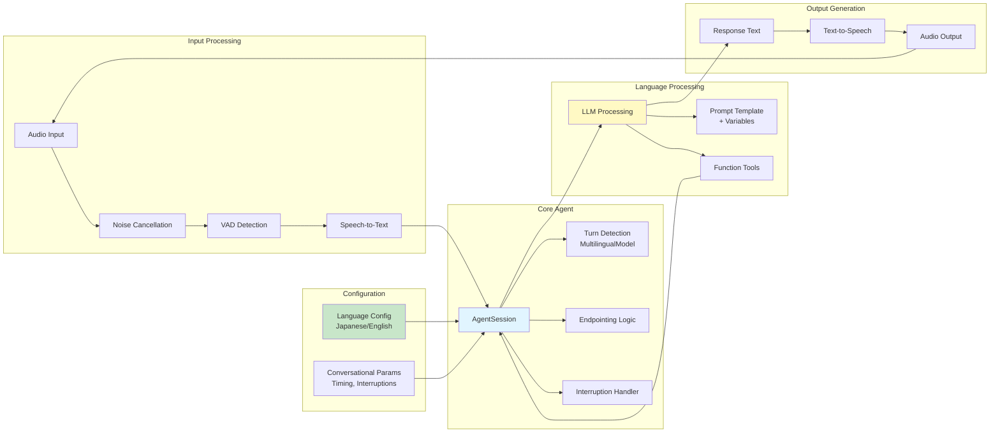
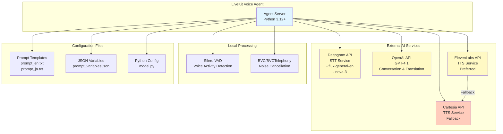

# Python LiveKit Voice Agent

A multilingual voice AI agent built on LiveKit Agents framework, designed for **outbound international logistics calls** from Japan to overseas partners. The agent provides real-time translation, structured information gathering, and automatic conversation logging to eliminate language barriers, time zone constraints, and communication gaps in cross-border logistics operations.

---

## What This Agent Does

This voice AI agent handles **outbound phone calls (Japan → Overseas)** for international logistics coordination with:

- **Overseas warehouses**
- **Overseas shipping companies**  
- **Overseas e-commerce businesses**

### Priority Scenario: Delivery Delay Inquiry

The primary use case is **delivery delay confirmation calls to overseas logistics companies**. This scenario is prioritized because:

- **High frequency** - Delivery delays occur frequently in international logistics
- **Clear value demonstration** - The speed advantage over email is immediately apparent
- **B2B context** - Less emotional handling required, more straightforward fact-gathering

**Call Flow:**
1. Agent calls overseas logistics company
2. States purpose in English: "Tracking number XXXXX, delivery delay status"
3. Gathers information: current location, delay reason, new expected delivery date
4. Summarizes response and confirms delay reason and next action
5. Creates automatic conversation log for record-keeping

### Key Capabilities

- **Real-time Language Translation** - Instantly translates between Japanese and English during the call
- **Structured Information Gathering** - Extracts key details (tracking numbers, delivery dates, issues) through systematic questioning
- **Conversation Logging** - Automatically transcribes and summarizes all calls for record-keeping and evidence
- **Time Zone Independence** - Handles calls during overseas business hours without requiring Japanese staff availability
- **Dispute Prevention** - Confirms understanding and agreements in real-time to prevent "I said/I didn't say" situations

---

## Currently Implemented

### Core Infrastructure ✅

1. **LiveKit Agent Framework**

   - Full integration with LiveKit Agents SDK
   - AgentServer and AgentSession setup
   - Real-time audio streaming and processing
   - Room I/O with noise cancellation support

2. **Speech Services Integration**

   - **STT (Speech-to-Text)**: Deepgram with language-specific models
     - English: `flux-general-en` model
     - Japanese: `nova-3` model
   - **LLM**: OpenAI GPT-4.1 for conversation generation and real-time translation
   - **TTS (Text-to-Speech)**: 
     - **ElevenLabs** (preferred): Multilingual support with `eleven_multilingual_v2` for Japanese, `eleven_flash_v2_5` for English
     - **Cartesia** (fallback): Sonic-3 with language-specific voices
     - Configurable speed, volume, and emotion parameters
   - **VAD (Voice Activity Detection)**: Silero VAD for speech detection

3. **Language Support**

   - **English (en-US)**: Full support with optimized conversational parameters
   - **Japanese (ja-JP)**: Full support with culturally-appropriate timing

4. **Template-Based Prompting System**

   - Language-specific prompt files (`prompt_en.txt`, `prompt_ja.txt`)
   - Variable injection from JSON configuration (`prompt_variables.json`)
   - Dynamic variable substitution (e.g., `{{tracking_number}}`, `{{agent_name}}`)
   - Supports international logistics workflows with structured conversation patterns
   - Focused on outbound call scenarios (delivery delay inquiry, status confirmation)

5. **Cultural Conversational Configuration**

   - Language-specific turn detection and timing parameters
   - **Japanese settings**:
     - Longer interruption duration (0.8s)
     - More conservative endpointing delays (0.2-4.0s)
     - Requires 2+ words for interruption
   - **English settings**:
     - Faster response times (0.05-3.0s)
     - More responsive interruptions (0.3s, 1 word)
   - Multilingual turn detector model for context-aware turn detection

6. **Function Tools**

   - `get_current_time()` - Provides current date and time (useful for time zone coordination)
   - `search_knowledge_base()` - Placeholder for knowledge base queries (tracking info, shipment details)
   - `hang_up()` - Gracefully ends calls with goodbye messages

7. **Configuration Management**

   - Environment variable support (`.env.local`)
   - Configurable TTS parameters (speed, volume, emotion)
   - Language selection via `AGENT_LANGUAGE` environment variable
   - Optional preemptive generation and user away timeout

8. **Noise Cancellation**
   - Automatic noise cancellation for telephony calls (BVCTelephony)
   - Standard noise cancellation for regular participants (BVC)

---

## What It Does NOT Do Yet (Future Implementation)

The following features are planned but not yet implemented:

### 1. Call Pack Data Model ❌

- **Status**: Not implemented
- **Planned**: Structured data model to preprocess and store all call variables before the call begins
- **Example structure**:
  ```json
  {
    "language": "ja-JP",
    "orderId": "59127",
    "deliveryDate": "2024-01-15",
    "windowStart": "09:00",
    "windowEnd": "17:00",
    "poNumber": "PO-12345",
    "palletCount": 5,
    "truckType": "box truck"
  }
  ```

### 2. Call Scheduler ❌

- **Status**: Not implemented
- **Planned**: Automated call scheduling and retry logic
- **Features**:
  - Up to 3 retry attempts
  - 1 hour delay between attempts
  - Voicemail detection via energy pattern analysis
  - Business hours enforcement
  - Attempt logging with timestamps

### 3. Advanced Silence Modeling Engine ❌

- **Status**: Partially implemented (basic timing parameters exist)
- **Planned**: Sophisticated silence analysis
- **Features**:
  - Distinguish between normal pauses, thinking, end of speech, disengagement
  - Context-aware silence interpretation
  - Automatic backchannel generation
  - Prevent unintentional interruptions

### 4. Cultural Intelligence Layer ❌

- **Status**: Partially implemented (TTS emotion settings exist)
- **Planned**: Advanced prosody and pacing adjustments
- **Features**:
  - Text transformation before TTS
  - Natural pause insertion
  - Culturally-appropriate intonation patterns
  - Sentence ending modifications
  - Acknowledgement phrase insertion

### 5. Structured Call Logging and Post-Call Output ❌

- **Status**: Not implemented
- **Planned**: Comprehensive call analytics
- **Features**:
  - Final transcript generation
  - Structured call summary (JSON format)
  - Extracted conversation variables
  - Call status records (success, no answer, voicemail, etc.)
  - Storage integration (S3 or database)
  - 90-day log retention
  - Call ID and Order ID as primary keys

### 6. Conversation State Machine ❌

- **Status**: Not implemented
- **Planned**: Explicit state management for call flow
- **States**:
  - Call Initiated
  - Introduction Delivered
  - Information Presented
  - Awaiting Response
  - Handling Questions
  - Confirming Next Steps
  - Closing
  - Ending Call

### 7. Template-Based Conversation Flow ❌

- **Status**: Partially implemented (prompt templates exist, but not strict flow control)
- **Planned**: Strict template-based conversation with fixed scripts
- **Features**:
  - Introduction template
  - Information delivery template
  - Confirmation request template
  - Clarification templates
  - Closing template
  - Error fallback templates

### 8. Advanced Observability ❌

- **Status**: Basic logging exists
- **Planned**: Comprehensive metrics and monitoring
- **Features**:
  - Silence duration tracking
  - Response timing metrics
  - Turn-taking behavior analysis
  - Template usage statistics
  - Rule-based response trigger logging
  - Performance dashboards

---

## Technical Architecture

### Current Stack

- **Framework**: LiveKit Agents SDK v1.2+
- **Python**: 3.12+
- **STT**: Deepgram (flux-general-en, nova-3)
- **LLM**: OpenAI GPT-4.1
- **TTS**: ElevenLabs (preferred) or Cartesia (fallback)
- **VAD**: Silero
- **Noise Cancellation**: BVC/BVCTelephony

### Architecture Diagrams

#### System Architecture Overview



#### Call Flow Architecture



#### Component Interaction Diagram



#### Service Integration Architecture



### Project Structure

```
livekit-voice-agent/
├── agent.py              # Main agent server and session setup
├── model.py              # Conversational configuration models
├── tools.py              # Function tools for the agent
├── prompt_en.txt        # English prompt template
├── prompt_ja.txt        # Japanese prompt template
├── prompt_variables.json # Variable substitution data
├── pyproject.toml       # Project dependencies
└── CONVERSATIONAL_CONFIG.md # Detailed configuration guide
```

---

## Setup and Configuration

### Prerequisites

1. Python 3.12 or 3.13 (3.14 is not supported due to `livekit-blingfire` dependency limitations)
2. LiveKit account and credentials
3. API keys for:
   - Deepgram (STT)
   - OpenAI (LLM)
   - ElevenLabs (TTS, preferred) **OR** Cartesia (TTS, fallback)

### Installation

```bash
# Install dependencies
pip install -e .

# Or using uv
uv pip install -e .
```

### Environment Variables

Create a `.env.local` file with:

```env
# Required
DEEPGRAM_API_KEY=your_deepgram_key
OPENAI_API_KEY=your_openai_key

# TTS Provider (choose one)
ELEVEN_API_KEY=your_elevenlabs_key  # Preferred for multilingual support
# OR
CARTESIA_API_KEY=your_cartesia_key  # Fallback option

# Optional - ElevenLabs Configuration
ELEVEN_VOICE_ID_EN=ODq5zmih8GrVes37Dizd
ELEVEN_VOICE_ID_JA=EXAVITQu4vr4xnSDxMaL
ELEVEN_MODEL_EN=eleven_flash_v2_5
ELEVEN_MODEL_JA=eleven_multilingual_v2
ELEVEN_STABILITY=0.5
ELEVEN_SIMILARITY_BOOST=0.75

# Optional - General Configuration
AGENT_LANGUAGE=en-US  # or ja-JP
TTS_SPEED=1.0
TTS_VOLUME=1.0
TTS_EMOTION=friendly  # or calm for Japanese
PREEMPTIVE_GENERATION=false
USER_AWAY_TIMEOUT=15.0
```

### Running the Agent

```bash
# Using LiveKit CLI
livekit-agents dev

# Or directly
python -m livekit_voice_agent.agent
```

---

## Configuration Details

### Conversational Parameters

The agent uses language-specific conversational configurations that control:

- **Turn Detection**: Multilingual model for context-aware turn detection
- **Interruption Handling**: Duration and word count thresholds
- **Endpointing**: Minimum/maximum delays before responding
- **User State**: Away timeout detection
- **Tool Calls**: Maximum tool execution steps

See `CONVERSATIONAL_CONFIG.md` for detailed parameter documentation.

### Prompt Variables

Edit `prompt_variables.json` to customize:

- Carrier brand name
- Logistics company name
- Agent name
- Tracking numbers
- Delivery dates and times
- PO numbers, shipment details

Variables are automatically injected into prompt templates using `{{variable_name}}` syntax.

---

## Why Voice AI for International Logistics?

### Core Problems Solved

1. **Language Barriers** - Real-time translation eliminates the need for English-proficient staff. Reduces mishearing and recognition errors that can be fatal in logistics.

2. **Vague Explanations** - Overseas shipping companies often provide incomplete information. Voice AI extracts necessary information through structured questioning, organizes key points, and summarizes conversations immediately.

3. **Time Zone Issues** - Automated calls during overseas business hours without requiring Japanese staff availability. Enables "progress while Japan sleeps" scenarios.

4. **Dispute Control** - During delivery delays or losses, maintains control through fact-based conversations, record-keeping, and preventing topic shifts. Focuses on "what's happening now" rather than emotional arguments.

5. **Conversation Logs as Evidence** - Automatic transcription and summarization creates evidence for internal sharing, compensation negotiations, and recurrence prevention.

6. **Eliminating Personal Dependency** - Removes reliance on specific employees with language skills. Anyone can handle overseas communication with consistent quality.

### Advantages Over Email

1. **No Waiting for Replies** - Immediate connection vs. waiting hours or days for email responses. Critical for delay and loss handling.

2. **Clarify Ambiguous Responses Immediately** - Can determine specific deadlines, responsible parties, and next actions during the conversation. Prevents vague responses like "We will check" or "Soon."

3. **Faster Resolution** - Multiple rounds of questions resolved in a single call vs. days of email back-and-forth. Speed is critical in logistics troubleshooting.

4. **Signals Urgency** - Phone calls are recognized as urgent in overseas markets. Higher priority than emails that get buried in queues.

5. **Real-time Misunderstanding Correction** - Can confirm understanding, rephrase, and reach agreement immediately. Prevents "I didn't hear that" situations.

6. **Automatic Transcription** - Combines phone speed with email's record-keeping. Full conversation text, key point summaries, and timestamp/party association.

7. **Faster Escalation Judgment** - Voice tone reveals urgency and response attitude. Can quickly determine problem severity and escalate to human handling if needed.

---

## Future Roadmap

### Phase 1: Priority Scenario Implementation

- [x] Outbound call handling for delivery delay inquiry
- [ ] Call Pack data model for tracking numbers and shipment details
- [ ] Structured call logging and automatic summarization
- [ ] Conversation state machine for delivery delay scenarios

### Phase 2: Call Management

- [ ] Automated call scheduler with retry logic
- [ ] Business hours enforcement (overseas time zones)
- [ ] Voicemail detection and handling
- [ ] Automatic follow-up email generation from call summaries

### Phase 3: Additional Scenarios

- [ ] Status confirmation calls
- [ ] Priority handling requests
- [ ] Tracking number verification
- [ ] Agreement confirmation ("I said/I didn't say" prevention)

### Phase 4: Advanced Features

- [ ] Enhanced silence modeling engine
- [ ] Full cultural intelligence layer
- [ ] Template-based conversation flow control
- [ ] Performance metrics and dashboards
- [ ] Storage integration (S3/database) for call logs

---

## Contributing

This project is actively under development. Contributions are welcome for:

- Implementing delivery delay inquiry scenarios
- Improving structured information gathering patterns
- Adding support for additional international logistics scenarios
- Enhancing conversation logging and summarization
- Enhancing error handling and reliability

---

## License

[Add your license information here]

---

## References

- [LiveKit Agents Documentation](https://docs.livekit.io/agents/)
- [LiveKit Conversational Design Guide](https://docs.livekit.io/agents/conversational-design/)
- [Deepgram API Documentation](https://developers.deepgram.com/)
- [Cartesia API Documentation](https://docs.cartesia.ai/)
